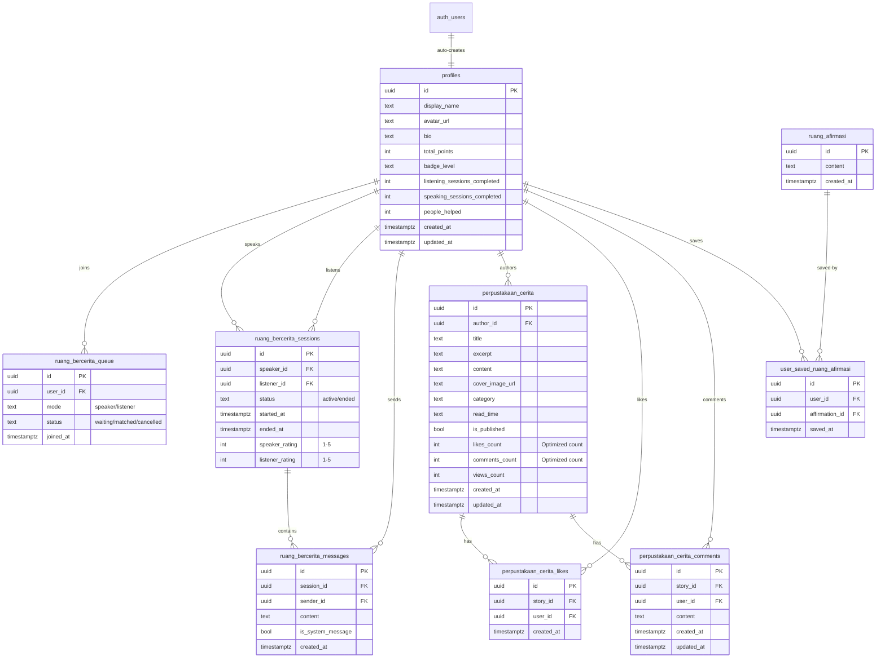

# Ceritain Database Schema - ERD

## Mermaid Diagram

## Table Summary

### 1. **Profiles & Authentication**
- `profiles` - User profiles with gamification stats

### 2. **Ruang Bercerita** (Mental Health Chat)
- `ruang_bercerita_queue` - Matchmaking queue for speakers/listeners
- `ruang_bercerita_sessions` - Active chat sessions
- `ruang_bercerita_messages` - Chat messages within sessions

### 3. **Perpustakaan Cerita** (Story Library)
- `perpustakaan_cerita` - User-generated stories
- `perpustakaan_cerita_likes` - Story likes
- `perpustakaan_cerita_comments` - Story comments

### 4. **Ruang Afirmasi** (Affirmations)
- `ruang_afirmasi` - Affirmation messages
- `user_saved_ruang_afirmasi` - Users' saved affirmations

## Key Features

### Security (RLS Policies)
- ✅ Users can only update their own profiles
- ✅ Only session participants can view messages
- ✅ Authors can manage their own stories
- ✅ Users can only save/unsave their own affirmations

### Real-time Features
- ✅ Live chat messaging (`ruang_bercerita_messages`)
- ✅ Matchmaking queue updates (`ruang_bercerita_queue`)

### Gamification
- 📊 Points system
- 🏆 Badge levels (Bronze → Gold)
- 📈 Session completion tracking
- 💚 People helped counter
